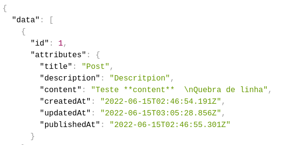

# Blog NextJS 

Aviso antes de tudo:

Comecei o projeto pensando em utilizar o Strapi, porém após 2 dias procruando algumas soluções acabei percebendo que a o headless cms não é "bom" para se construír um blog, os próprios devs avisam para você procurar uma lib para o markdown funcionar corretamente junto com a quebra de linha.

Irei criar um outro layout e possívemente consumir outro headless.

use `npx create-strapi-app nameProject` e crie sua conta.

Settings -> user &USERS & PERMISSIONS PLUGIN -> Public -> "nome da colletion que criou, nesse caso post", e libere para ter acesso via API.

Resposta da API, crie os campos de "Atrributes" caso queira t estar

